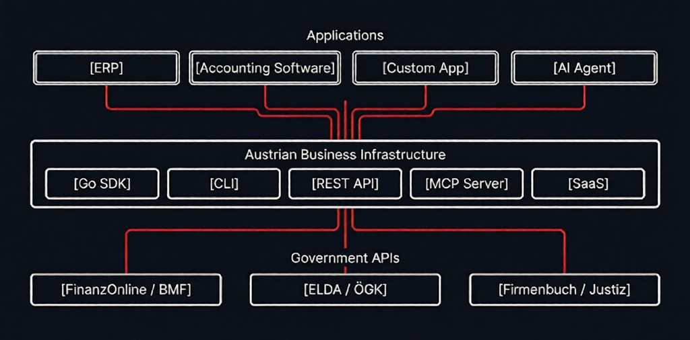

<div align="center">

# Austrian Business Infrastructure

**Go toolkit for Austrian government API integrations**

[](https://go.dev/)
[](LICENSE)
[](https://www.postgresql.org/)

</div>

---

## Why this exists

Austrian government services have APIs — FinanzOnline, ELDA, Firmenbuch. They work. But they're SOAP-based, XML-heavy, and undocumented in any practical sense.

Every company that needs to integrate builds their own wrappers from scratch. There's no shared open-source foundation.

This project fixes that.

---

## How it works



Your application talks to this library. This library talks to the government APIs. You never touch SOAP.

**Use it as:**
- **Go SDK** — Import into your Go code
- **CLI** — Automate from terminal or scripts
- **REST API** — Integrate from any language
- **MCP Server** — Connect AI assistants directly
- **SaaS Platform** — Full multi-tenant web application

---

## What's included

| Module | Capabilities |
|--------|--------------|
| **FinanzOnline** | Session handling, databox polling, UVA/ZM submission, UID validation |
| **ELDA** | Employee registration (Anmeldung/Abmeldung), L16, mBGM |
| **Firmenbuch** | Company search, extracts, watchlist monitoring |
| **E-Rechnung** | XRechnung/ZUGFeRD generation, EN16931 compliant |
| **SEPA** | Payment files (pain.001, pain.008), bank statements (camt.053) |
| **Digital Signatures** | Qualified electronic signatures via A-Trust, ID Austria |
| **Document Analysis** | OCR + LLM-based classification and data extraction |
| **Förderungsradar** | 74 Austrian funding programs with eligibility matching |

---

## Architecture


<details>
<summary><strong>Project structure</strong></summary>

```
cmd/
├── fo/          CLI tool
├── server/      REST API server
└── worker/      Background jobs

internal/        69 packages
├── fonws/       FinanzOnline WebService
├── elda/        ELDA client
├── firmenbuch/  Firmenbuch client
├── erechnung/   Invoice generation
├── sepa/        SEPA handling
├── signature/   Digital signatures
├── foerderung/  74 funding programs
├── matcher/     LLM matching
├── analysis/    Document analysis
├── security/    RLS, rate limiting
├── auth/        JWT, 2FA
└── ...

frontend/        SvelteKit dashboard
portal/          Client portal
migrations/      22 database migrations
```

</details>

---

## Quick Start

**Build the CLI**
```bash
go build -o fo ./cmd/fo
```

**Add an account and check databox**
```bash
./fo account add --name "Muster GmbH" --tid 123456789 --benid USER01
./fo databox list "Muster GmbH"
```

**Submit a UVA**
```bash
./fo uva submit --input uva.json --account "Muster GmbH"
```

**Deploy self-hosted**
```bash
./scripts/generate-secrets.sh > .env
echo "DOMAIN=your-domain.com" >> .env
docker compose -f docker-compose.selfhost.yml up -d
```

---

## CLI Commands

```
fo account     Manage FinanzOnline/ELDA/Firmenbuch accounts
fo databox     Poll FinanzOnline databox
fo uva         Submit Umsatzsteuervoranmeldung
fo zm          Submit Zusammenfassende Meldung
fo elda        Employee registration
fo fb          Firmenbuch search and extracts
fo erechnung   Generate XRechnung/ZUGFeRD
fo sepa        Generate SEPA payment files
fo sign        Digital signatures
fo foerderung  Search funding programs
fo analyze     Document analysis
fo mcp         MCP server for AI assistants
```

---

## REST API

Available at `/api/v1/`:

```
POST   /auth/login           Authentication
GET    /accounts             List accounts
POST   /accounts/:id/sync    Trigger sync
GET    /documents            List documents
POST   /uva/submit           Submit UVA
POST   /sepa/pain001         Generate SEPA
GET    /foerderung/match     Match funding
WS     /ws                   Real-time updates
```

---

## MCP Server

Connect AI assistants to Austrian government APIs:

```json
{
  "mcpServers": {
    "austrian-business": {
      "command": "./fo",
      "args": ["mcp", "serve", "--stdio"]
    }
  }
}
```

---

## Security

This handles tax filings and government credentials. Security is non-negotiable.

| Layer | Implementation |
|-------|----------------|
| Authentication | ES256 JWT, TOTP 2FA |
| Authorization | Row-Level Security (PostgreSQL) |
| IDOR Protection | AccountVerifier pattern |
| Encryption | AES-256-GCM at rest |
| CI/CD | GitHub Actions pinned to SHA |
| Scanning | gosec, govulncheck, Trivy |
| Compliance | DSGVO, OWASP Top 10, eIDAS |

---

## Numbers

| 69 | 9 | 74 | 22 |
|:--:|:--:|:--:|:--:|
| Go packages | Government APIs | Funding programs | DB migrations |

---

## Requirements

| Component | Version |
|-----------|---------|
| Go | 1.24+ |
| PostgreSQL | 14+ |
| Redis | 7+ |
| Node.js | 20+ (frontend) |

**Credentials:**
- **FinanzOnline**: TID, BENID, PIN — [finanzonline.bmf.gv.at](https://finanzonline.bmf.gv.at)
- **ELDA**: Certificate from ÖGK
- **Firmenbuch**: API key (optional)
- **A-Trust**: Signing credentials (optional)

---

## Contributing

```bash
git checkout -b feature/your-feature
go test ./...
go build ./...
```

---

## License

AGPL-3.0 — [LICENSE](LICENSE)

---

<div align="center">

[Documentation](docs/) · [Issues](https://github.com/aliuyar1234/austrian-business-infrastructure/issues)

</div>
