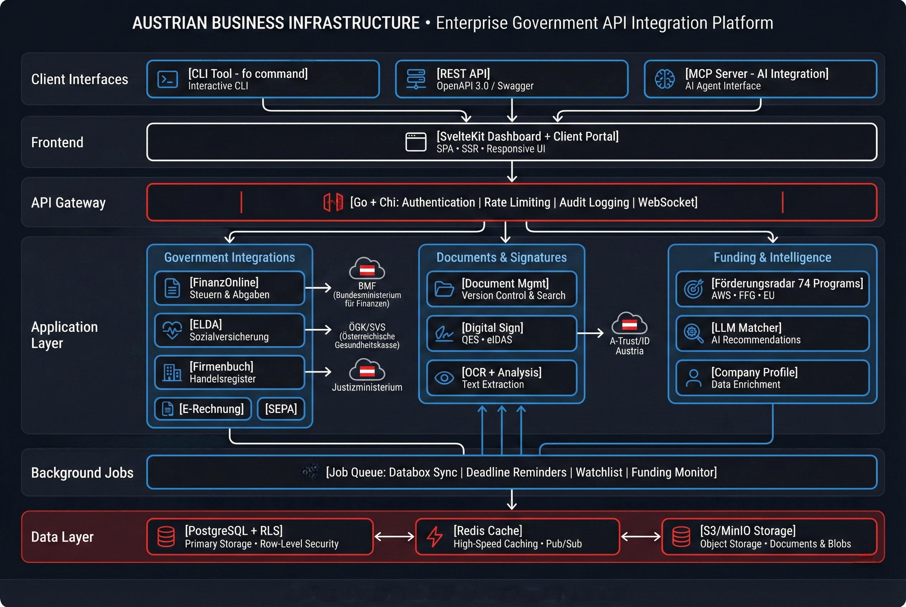

<div align="center">

# Austrian Business Infrastructure

**Open-source Go toolkit for Austrian government API integrations**

[](https://go.dev/)
[](LICENSE)
[](https://www.postgresql.org/)

</div>

---

## What is this?

A complete backend for integrating with Austrian government services: **FinanzOnline**, **ELDA**, **Firmenbuch**, and more. Handles the SOAP/XML complexity so you don't have to.

Ships as a Go library, CLI tool, REST API, and full SaaS platform.



---

## Modules

| Module | Description | Status |
|--------|-------------|--------|
| **FinanzOnline** | Session management, databox, UVA, ZM, UID validation | Production |
| **ELDA** | Employee registration/deregistration, L16, mBGM | Production |
| **Firmenbuch** | Company search, extracts, watchlist monitoring | Production |
| **E-Rechnung** | XRechnung/ZUGFeRD generation (EN16931) | Production |
| **SEPA** | pain.001, pain.008, camt.053 | Production |
| **Digital Signatures** | A-Trust, ID Austria (QES/eIDAS) | Production |
| **Document Analysis** | OCR + LLM classification | Production |
| **Förderungsradar** | 74 Austrian funding programs, eligibility matching | Production |

---

## Quick Start

### CLI

```bash
go build -o fo ./cmd/fo

# Add account
./fo account add --name "Muster GmbH" --tid 123456789 --benid USER01

# Check databox
./fo databox list "Muster GmbH"

# Submit UVA
./fo uva submit --input uva.json --account "Muster GmbH"
```

### Self-Hosted

```bash
./scripts/generate-secrets.sh > .env
echo "DOMAIN=your-domain.com" >> .env
docker compose -f docker-compose.selfhost.yml up -d
```

### Development

```bash
docker compose up -d postgres redis
cp .env.example .env
go run ./cmd/server
```

---

## CLI Reference

```
fo account     Manage accounts (FinanzOnline, ELDA, Firmenbuch)
fo databox     Poll FinanzOnline databox
fo uva         Submit Umsatzsteuervoranmeldung
fo zm          Submit Zusammenfassende Meldung
fo elda        Employee registration (Anmeldung/Abmeldung)
fo fb          Firmenbuch search and extracts
fo erechnung   Generate XRechnung/ZUGFeRD invoices
fo sepa        Generate SEPA payment files
fo sign        Digital signatures via A-Trust/ID Austria
fo foerderung  Search Austrian funding programs
fo analyze     AI document analysis
fo mcp         Start MCP server for AI assistants
```

---

## API

REST API available at `/api/v1/`:

```
POST   /auth/login           JWT authentication
GET    /accounts             List accounts
POST   /accounts/:id/sync    Trigger databox sync
GET    /documents            List documents
POST   /uva/submit           Submit UVA
POST   /sepa/pain001         Generate SEPA file
GET    /foerderung/match     Match funding programs
WS     /ws                   Real-time updates
```

---

## MCP Server

For AI assistant integration (Claude, etc.):

```json
{
  "mcpServers": {
    "austrian-business": {
      "command": "./fo",
      "args": ["mcp", "serve", "--stdio"]
    }
  }
}
```

---

## Security

| Layer | Implementation |
|-------|----------------|
| Authentication | ES256 JWT, TOTP 2FA |
| Authorization | Row-Level Security (PostgreSQL) |
| IDOR Protection | AccountVerifier on write operations |
| Encryption | AES-256-GCM at rest |
| CI/CD | GitHub Actions pinned to SHA |
| Scanning | gosec, govulncheck, Trivy |
| Compliance | DSGVO, OWASP Top 10, eIDAS |

---

## Project Structure

```
cmd/
├── fo/          CLI
├── server/      HTTP API
└── worker/      Background jobs

internal/        69 packages
├── fonws/       FinanzOnline client
├── elda/        ELDA client
├── firmenbuch/  Firmenbuch client
├── erechnung/   E-invoice generation
├── sepa/        SEPA handling
├── signature/   Digital signatures
├── foerderung/  Funding programs (74)
├── matcher/     LLM eligibility matching
├── analysis/    Document OCR/classification
├── security/    RLS, rate limiting
└── ...

frontend/        SvelteKit dashboard
portal/          Client portal
migrations/      22 PostgreSQL migrations
```

---

## Requirements

| Component | Version |
|-----------|---------|
| Go | 1.24+ |
| PostgreSQL | 14+ |
| Redis | 7+ |
| Node.js | 20+ (frontend) |

### Credentials

- **FinanzOnline**: TID, BENID, PIN from [finanzonline.bmf.gv.at](https://finanzonline.bmf.gv.at)
- **ELDA**: Certificate from ÖGK
- **Firmenbuch**: API key (optional)
- **A-Trust**: Signing credentials (optional)

---

## Contributing

```bash
git checkout -b feature/your-feature
go test ./...
go build ./...
# Submit PR
```

---

## License

AGPL-3.0 — See [LICENSE](LICENSE)

---

<div align="center">

[Documentation](docs/) · [Issues](https://github.com/aliuyar1234/austrian-business-infrastructure/issues)

</div>
